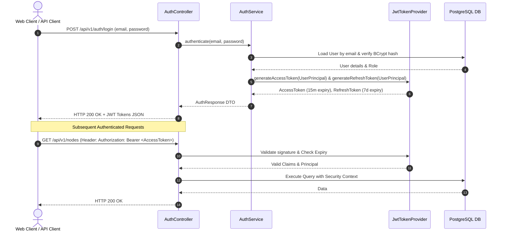

# Architecture Specification: KnowledgeNetwork Platform

**System Name:** KnowledgeNetwork  
**Architect:** Senior Software Architect  
**Target Stack:** Spring Boot 3.2+, Java 21 LTS, PostgreSQL 16+, JWT, Docker, RESTful APIs  
**Document Status:** Production-Ready Architectural Design  

---

## 1. Functional Requirements

### 1.1 User & Identity Management
- **User Registration & Authentication:** Secure email/password registration with JWT-based stateless authentication, token refresh, and password hashing (BCrypt with cost factor 12).
- **Workspace & Team Management:** Users can create, join, and manage workspaces (collaborative graph projects). Multi-tenant logical isolation per workspace.
- **Role-Based Access Control (RBAC):** Granular permissions mapped to predefined roles:
  - `SYSTEM_ADMIN`: Platform-wide administrative privileges.
  - `WORKSPACE_OWNER`: Full administrative control over workspace settings, members, and graph data.
  - `WORKSPACE_EDITOR`: Ability to create, modify, and delete nodes, edges, tags, and graph annotations.
  - `WORKSPACE_VIEWER`: Read-only access to view graph visualizations, export data, and execute traversal queries.

### 1.2 Knowledge Graph Management
- **Entity (Node) Operations:**
  - Create, read, update, soft-delete nodes.
  - Custom entity types (e.g., `Concept`, `Document`, `Person`, `Technology`, `Event`).
  - Dynamic key-value attribute payload storage via JSONB (e.g., custom metadata, properties, external references).
  - Categorization and tagging support.
- **Relationship (Edge) Operations:**
  - Establish directed or undirected relationships between nodes.
  - Typed relationships (e.g., `DEPENDS_ON`, `CONTRIBUTES_TO`, `REFERENCES`, `SUBCLASS_OF`).
  - Edge properties (weight, confidence score, dynamic JSONB metadata).
  - Prevention of orphaned edges and invalid cycles where constrained.

### 1.3 Collaborative Features
- **Concurrent Editing Management:** Optimistic locking mechanism (`@Version` field) to prevent conflicting overwrites during concurrent updates.
- **Audit Logging & Activity Feed:** Detailed tracking of entity mutations (creation, updates, deletions) with user timestamps and delta records.
- **Graph Versioning & Revision History:** Snapshotting graph states; capability to query graph state at a specific point in time or revert to historical revisions.

### 1.4 Search & Traversal Engine
- **Full-Text Entity Search:** Search across node labels, descriptions, and dynamic JSONB attributes using PostgreSQL Full-Text Search (`tsvector`/`tsquery`).
- **Graph Traversal API:** Breadth-First Traversal (BFS) and Depth-First Traversal (DFS) up to a configurable max-depth ($N$ hops) using PostgreSQL Recursive Common Table Expressions (CTEs).
- **Filtering & Subgraph Extraction:** Extract subgraphs based on entity types, relationship types, date ranges, and attribute filters.

---

## 2. Non-Functional Requirements

### 2.1 Performance & Latency
- **API Response Time:** Sub-100ms for single-entity CRUD operations; sub-300ms for $N$-hop graph traversal queries up to depth 4.
- **Database Query Efficiency:** All foreign keys, graph link queries (`source_node_id`, `target_node_id`), and search columns backed by B-Tree, GIN (JSONB), and GiST indexes.
- **Connection Pooling:** High-performance database connection pooling managed via HikariCP configured for optimal thread utilization.

### 2.2 Scalability & Availability
- **Stateless Application Tier:** Spring Boot service instances are completely stateless, enabling horizontal autoscaling behind a Reverse Proxy / Load Balancer (e.g., NGINX / AWS ALB).
- **Read/Write Splitting Capability:** Architecture designed to support PostgreSQL primary node for writes and Read Replicas for read-heavy graph traversal queries.
- **Database Partitioning Strategy:** Logical multi-tenancy with index partition readiness on `workspace_id` for massive graph scaling.

### 2.3 Security & Compliance
- **Authentication & Stateless Sessions:** JWT (JSON Web Tokens) signed via HMAC-SHA512 or RSA-2048 with short-lived Access Tokens (15 mins) and sliding Refresh Tokens (7 days).
- **Zero Trust Data Access:** Strict authorization enforcement at API entry points and service layer method level using `@PreAuthorize`.
- **Data Protection:** Data in transit encrypted via TLS 1.3; data at rest protected using PostgreSQL tablespace encryption and secure secret management.
- **Input Validation & Sanitization:** Strict request validation using Jakarta Bean Validation (JSR-380) to mitigate SQL injection, XSS, and remote code execution vulnerabilities.

### 2.4 Reliability & Maintainability
- **Transactional Integrity:** ACID guarantees across complex graph mutation pipelines using Spring `@Transactional` management.
- **Modular Code Architecture:** Strict separation of concerns following clean, layered architecture patterns (Controller-Service-Repository-Domain DTO).
- **API Standardization:** OpenAPI 3.0 (Swagger) automated documentation with consistent JSON response wrappers and RFC 7807 problem details error handling.

---

## 3. Core Use Cases

### UC-01: User Authentication & Workspace Initialization
- **Actor:** Registered User / Team Lead
- **Preconditions:** User possesses registered credentials.
- **Flow:**
  1. User posts credentials to `/api/v1/auth/login`.
  2. System validates credentials, issues Access & Refresh JWTs.
  3. User initializes a new Workspace via `POST /api/v1/workspaces`.
  4. System establishes user as `WORKSPACE_OWNER` and creates workspace context.

### UC-02: Collaborative Entity & Relationship Creation
- **Actor:** Workspace Editor
- **Preconditions:** User holds `WORKSPACE_EDITOR` role in target workspace.
- **Flow:**
  1. User creates Node $A$ (`Concept`) and Node $B$ (`Technology`).
  2. System validates schema, inserts records with JSONB properties, logs audit trail.
  3. User creates directed Edge $E1$ from Node $A$ to Node $B$ with type `USES`.
  4. System verifies both nodes exist within the same workspace boundary and inserts edge with version tracker.

### UC-03: Graph Traversal & Subgraph Discovery
- **Actor:** Workspace Viewer / Editor / Owner
- **Preconditions:** User has access to workspace.
- **Flow:**
  1. User submits traversal request specifying `rootNodeId`, `maxDepth` (e.g., 3), and optional `edgeType` filters to `/api/v1/graphs/traverse`.
  2. System executes Recursive CTE query against PostgreSQL `edges` and `nodes` tables.
  3. System formats and returns complete subgraph (array of nodes and connecting edges) wrapped in standard API response.

### UC-04: Conflict Resolution via Optimistic Locking
- **Actor:** Concurrent Workspace Editors
- **Flow:**
  1. Editor 1 and Editor 2 read Node $A$ (version = 1).
  2. Editor 1 submits update to Node $A$. System updates record, increments version to 2.
  3. Editor 2 attempts update sending version = 1.
  4. System detects version mismatch, rejects request with HTTP 409 Conflict, returning RFC 7807 Error details.

---

## 4. Architecture Diagram

```mermaid
flowchart TB
    subgraph Client_Layer [Client & Consumer Layer]
        WebClient["Web UI Application (React / Next.js)"]
        APIClient["Third-Party API Clients / CLI"]
    end

    subgraph Edge_Layer [Ingress & Reverse Proxy]
        NGINX["NGINX / Reverse Proxy (TLS 1.3 Termination)"]
    end

    subgraph App_Layer [Spring Boot 3 Application Runtime (Java 21)]
        direction TB
        
        subgraph Security_Module [Security Chain]
            JWTFilter["JwtAuthenticationFilter"]
            SecConfig["SecurityFilterChain (Spring Security 6)"]
        end

        subgraph API_Controllers [REST Controller Layer]
            AuthCtrl["AuthController"]
            WorkCtrl["WorkspaceController"]
            NodeCtrl["NodeController"]
            EdgeCtrl["EdgeController"]
            GraphCtrl["GraphTraversalController"]
        end

        subgraph Service_Layer [Business Logic & Service Layer]
            AuthSvc["AuthService"]
            WorkSvc["WorkspaceService"]
            NodeSvc["NodeService"]
            EdgeSvc["EdgeService"]
            GraphSvc["GraphTraversalService"]
            AuditSvc["AuditLogService"]
        end

        subgraph Persistence_Layer [Data Access Layer]
            UserRepo["UserRepository"]
            WorkRepo["WorkspaceRepository"]
            NodeRepo["NodeRepository"]
            EdgeRepo["EdgeRepository (Custom Recursive CTEs)"]
            AuditRepo["AuditLogRepository"]
        end
    end

    subgraph Database_Layer [PostgreSQL 16 Engine]
        direction LR
        PrimaryDB[(PostgreSQL Primary - RDBMS & JSONB)]
        Hikari["HikariCP Connection Pool"]
    end

    subgraph Container_Orchestration [Docker Runtime Infrastructure]
        DockerCompose["Docker Compose / Container Environment"]
    end

    %% Flow Connections
    WebClient -->|HTTPS / REST| NGINX
    APIClient -->|HTTPS / REST| NGINX
    NGINX -->|HTTP Internal| JWTFilter
    JWTFilter --> SecConfig
    SecConfig --> API_Controllers
    API_Controllers --> Service_Layer
    Service_Layer --> Persistence_Layer
    Persistence_Layer --> Hikari
    Hikari --> PrimaryDB

    Container_Orchestration -. Orchestrates .-> App_Layer
    Container_Orchestration -. Orchestrates .-> Database_Layer
```

---

## 5. Entity-Relationship (ER) Diagram

```mermaid
erDiagram
    USERS ||--o{ WORKSPACE_MEMBERS : "belongs to"
    USERS ||--o{ AUDIT_LOGS : "performs"
    USERS ||--o{ GRAPH_VERSIONS : "creates"
    
    WORKSPACES ||--|{ WORKSPACE_MEMBERS : "contains"
    WORKSPACES ||--o{ NODE_TYPES : "defines"
    WORKSPACES ||--o{ EDGE_TYPES : "defines"
    WORKSPACES ||--o{ NODES : "owns"
    WORKSPACES ||--o{ EDGES : "owns"
    WORKSPACES ||--o{ GRAPH_VERSIONS : "tracks"
    
    NODE_TYPES ||--o{ NODES : "classifies"
    EDGE_TYPES ||--o{ EDGES : "classifies"
    
    NODES ||--o{ EDGES : "source for"
    NODES ||--o{ EDGES : "target for"
    NODES ||--o{ AUDIT_LOGS : "audited in"

    USERS {
        uuid id PK
        string email UK
        string password_hash
        string first_name
        string last_name
        boolean enabled
        timestamp created_at
        timestamp updated_at
    }

    WORKSPACES {
        uuid id PK
        string name
        string description
        uuid owner_id FK
        timestamp created_at
        timestamp updated_at
    }

    WORKSPACE_MEMBERS {
        uuid id PK
        uuid workspace_id FK
        uuid user_id FK
        string role
        timestamp joined_at
    }

    NODE_TYPES {
        uuid id PK
        uuid workspace_id FK
        string name
        string color_code
        string icon
        timestamp created_at
    }

    NODES {
        uuid id PK
        uuid workspace_id FK
        uuid node_type_id FK
        string label
        jsonb attributes
        integer version
        boolean is_deleted
        timestamp created_at
        timestamp updated_at
    }

    EDGE_TYPES {
        uuid id PK
        uuid workspace_id FK
        string name
        boolean is_directed
        timestamp created_at
    }

    EDGES {
        uuid id PK
        uuid workspace_id FK
        uuid edge_type_id FK
        uuid source_node_id FK
        uuid target_node_id FK
        double precision weight
        jsonb attributes
        integer version
        boolean is_deleted
        timestamp created_at
        timestamp updated_at
    }

    GRAPH_VERSIONS {
        uuid id PK
        uuid workspace_id FK
        integer version_number
        string description
        uuid created_by FK
        timestamp created_at
    }

    AUDIT_LOGS {
        uuid id PK
        uuid workspace_id FK
        uuid user_id FK
        string action
        string entity_type
        uuid entity_id
        jsonb snapshot_delta
        timestamp timestamp
    }
```

---

## 6. Folder & Package Structure

A scalable, package-by-feature / layered clean architecture inside Spring Boot 3 with Java 21:

```
com.knowledgenetwork
│
├── KnowledgeNetworkApplication.java
│
├── config/
│   ├── ApplicationConfig.java          # General Spring Beans & JSON Mapper Config
│   ├── SecurityConfig.java             # Spring Security 6 Filter Chain & CORS
│   ├── OpenAPIConfig.java              # Swagger / OpenAPI 3 specs
│   └── JPAConfig.java                  # Audit & Database configuration
│
├── security/
│   ├── JwtTokenProvider.java           # JWT Generation, Claims Parsing, Validation
│   ├── JwtAuthenticationFilter.java    # Per-request Security Filter
│   ├── CustomUserDetailsService.java   # UserDetails Loading implementation
│   ├── UserPrincipal.java              # Security User Principal encapsulation
│   └── RestAuthenticationEntryPoint.java# Custom 401/403 Handling
│
├── common/
│   ├── dto/
│   │   ├── ApiResponse.java            # Standard Unified JSON Wrapper
│   │   ├── PageResponse.java           # Pagination Wrapper
│   │   └── ErrorDetails.java          # RFC 7807 Problem Detail schema
│   ├── exception/
│   │   ├── ResourceNotFoundException.java
│   │   ├── ConcurrencyException.java
│   │   ├── UnauthorizedException.java
│   │   └── GlobalExceptionHandler.java # @ControllerAdvice Error Handler
│   └── util/
│       └── SecurityUtils.java          # Context retrieval helpers
│
├── domain/
│   ├── model/                          # JPA Entities
│   │   ├── User.java
│   │   ├── Workspace.java
│   │   ├── WorkspaceMember.java
│   │   ├── NodeType.java
│   │   ├── Node.java
│   │   ├── EdgeType.java
│   │   ├── Edge.java
│   │   ├── GraphVersion.java
│   │   └── AuditLog.java
│   │
│   ├── enums/
│   │   ├── WorkspaceRole.java          # OWNER, EDITOR, VIEWER
│   │   └── AuditAction.java            # CREATE, UPDATE, DELETE
│   │
│   └── payload/                        # Request / Response DTOs
│       ├── request/
│       │   ├── RegisterRequest.java
│       │   ├── LoginRequest.java
│       │   ├── WorkspaceCreateRequest.java
│       │   ├── NodeCreateRequest.java
│       │   ├── NodeUpdateRequest.java
│       │   ├── EdgeCreateRequest.java
│       │   └── TraversalQueryRequest.java
│       └── response/
│           ├── AuthResponse.java
│           ├── WorkspaceResponse.java
│           ├── NodeResponse.java
│           ├── EdgeResponse.java
│           └── GraphTraversalResponse.java
│
├── repository/
│   ├── UserRepository.java
│   ├── WorkspaceRepository.java
│   ├── WorkspaceMemberRepository.java
│   ├── NodeTypeRepository.java
│   ├── NodeRepository.java
│   ├── EdgeRepository.java             # Contains Recursive CTE Native Queries
│   ├── GraphVersionRepository.java
│   └── AuditLogRepository.java
│
├── service/
│   ├── AuthService.java
│   ├── WorkspaceService.java
│   ├── NodeService.java
│   ├── EdgeService.java
│   ├── GraphTraversalService.java      # Subgraph BFS/DFS traversal logic
│   └── AuditLogService.java
│
└── controller/
    ├── AuthController.java             # /api/v1/auth
    ├── WorkspaceController.java        # /api/v1/workspaces
    ├── NodeController.java             # /api/v1/nodes
    ├── EdgeController.java             # /api/v1/edges
    ├── GraphTraversalController.java   # /api/v1/graphs
    └── AuditLogController.java         # /api/v1/audit-logs
```

---

## 7. Database Design & Relational Graph Schema (PostgreSQL)

### 7.1 Table Schema Definitions

```sql
-- Enable UUID extension
CREATE EXTENSION IF NOT EXISTS "uuid-ossp";

-- 1. USERS TABLE
CREATE TABLE users (
    id UUID PRIMARY KEY DEFAULT uuid_generate_v4(),
    email VARCHAR(255) NOT NULL UNIQUE,
    password_hash VARCHAR(255) NOT NULL,
    first_name VARCHAR(100) NOT NULL,
    last_name VARCHAR(100) NOT NULL,
    enabled BOOLEAN NOT NULL DEFAULT TRUE,
    created_at TIMESTAMP WITH TIME ZONE NOT NULL DEFAULT CURRENT_TIMESTAMP,
    updated_at TIMESTAMP WITH TIME ZONE NOT NULL DEFAULT CURRENT_TIMESTAMP
);

-- 2. WORKSPACES TABLE
CREATE TABLE workspaces (
    id UUID PRIMARY KEY DEFAULT uuid_generate_v4(),
    name VARCHAR(150) NOT NULL,
    description TEXT,
    owner_id UUID NOT NULL REFERENCES users(id) ON DELETE RESTRICT,
    created_at TIMESTAMP WITH TIME ZONE NOT NULL DEFAULT CURRENT_TIMESTAMP,
    updated_at TIMESTAMP WITH TIME ZONE NOT NULL DEFAULT CURRENT_TIMESTAMP
);

-- 3. WORKSPACE_MEMBERS TABLE
CREATE TABLE workspace_members (
    id UUID PRIMARY KEY DEFAULT uuid_generate_v4(),
    workspace_id UUID NOT NULL REFERENCES workspaces(id) ON DELETE CASCADE,
    user_id UUID NOT NULL REFERENCES users(id) ON DELETE CASCADE,
    role VARCHAR(50) NOT NULL CHECK (role IN ('OWNER', 'EDITOR', 'VIEWER')),
    joined_at TIMESTAMP WITH TIME ZONE NOT NULL DEFAULT CURRENT_TIMESTAMP,
    CONSTRAINT uk_workspace_user UNIQUE (workspace_id, user_id)
);

-- 4. NODE_TYPES TABLE
CREATE TABLE node_types (
    id UUID PRIMARY KEY DEFAULT uuid_generate_v4(),
    workspace_id UUID NOT NULL REFERENCES workspaces(id) ON DELETE CASCADE,
    name VARCHAR(100) NOT NULL,
    color_code VARCHAR(10) DEFAULT '#3B82F6',
    icon VARCHAR(50) DEFAULT 'default-node',
    created_at TIMESTAMP WITH TIME ZONE NOT NULL DEFAULT CURRENT_TIMESTAMP,
    CONSTRAINT uk_workspace_nodetype UNIQUE (workspace_id, name)
);

-- 5. NODES TABLE (GRAPH ENTITIES)
CREATE TABLE nodes (
    id UUID PRIMARY KEY DEFAULT uuid_generate_v4(),
    workspace_id UUID NOT NULL REFERENCES workspaces(id) ON DELETE CASCADE,
    node_type_id UUID NOT NULL REFERENCES node_types(id) ON DELETE RESTRICT,
    label VARCHAR(255) NOT NULL,
    attributes JSONB NOT NULL DEFAULT '{}'::jsonb,
    version INTEGER NOT NULL DEFAULT 1,
    is_deleted BOOLEAN NOT NULL DEFAULT FALSE,
    created_at TIMESTAMP WITH TIME ZONE NOT NULL DEFAULT CURRENT_TIMESTAMP,
    updated_at TIMESTAMP WITH TIME ZONE NOT NULL DEFAULT CURRENT_TIMESTAMP
);

-- 6. EDGE_TYPES TABLE
CREATE TABLE edge_types (
    id UUID PRIMARY KEY DEFAULT uuid_generate_v4(),
    workspace_id UUID NOT NULL REFERENCES workspaces(id) ON DELETE CASCADE,
    name VARCHAR(100) NOT NULL,
    is_directed BOOLEAN NOT NULL DEFAULT TRUE,
    created_at TIMESTAMP WITH TIME ZONE NOT NULL DEFAULT CURRENT_TIMESTAMP,
    CONSTRAINT uk_workspace_edgetype UNIQUE (workspace_id, name)
);

-- 7. EDGES TABLE (GRAPH RELATIONSHIPS)
CREATE TABLE edges (
    id UUID PRIMARY KEY DEFAULT uuid_generate_v4(),
    workspace_id UUID NOT NULL REFERENCES workspaces(id) ON DELETE CASCADE,
    edge_type_id UUID NOT NULL REFERENCES edge_types(id) ON DELETE RESTRICT,
    source_node_id UUID NOT NULL REFERENCES nodes(id) ON DELETE CASCADE,
    target_node_id UUID NOT NULL REFERENCES nodes(id) ON DELETE CASCADE,
    weight DOUBLE PRECISION DEFAULT 1.0,
    attributes JSONB NOT NULL DEFAULT '{}'::jsonb,
    version INTEGER NOT NULL DEFAULT 1,
    is_deleted BOOLEAN NOT NULL DEFAULT FALSE,
    created_at TIMESTAMP WITH TIME ZONE NOT NULL DEFAULT CURRENT_TIMESTAMP,
    updated_at TIMESTAMP WITH TIME ZONE NOT NULL DEFAULT CURRENT_TIMESTAMP,
    CONSTRAINT chk_self_loop CHECK (source_node_id <> target_node_id)
);

-- 8. GRAPH_VERSIONS TABLE
CREATE TABLE graph_versions (
    id UUID PRIMARY KEY DEFAULT uuid_generate_v4(),
    workspace_id UUID NOT NULL REFERENCES workspaces(id) ON DELETE CASCADE,
    version_number INTEGER NOT NULL,
    description VARCHAR(255),
    created_by UUID NOT NULL REFERENCES users(id) ON DELETE RESTRICT,
    created_at TIMESTAMP WITH TIME ZONE NOT NULL DEFAULT CURRENT_TIMESTAMP,
    CONSTRAINT uk_workspace_version UNIQUE (workspace_id, version_number)
);

-- 9. AUDIT_LOGS TABLE
CREATE TABLE audit_logs (
    id UUID PRIMARY KEY DEFAULT uuid_generate_v4(),
    workspace_id UUID NOT NULL REFERENCES workspaces(id) ON DELETE CASCADE,
    user_id UUID REFERENCES users(id) ON DELETE SET NULL,
    action VARCHAR(50) NOT NULL,
    entity_type VARCHAR(50) NOT NULL,
    entity_id UUID NOT NULL,
    snapshot_delta JSONB,
    timestamp TIMESTAMP WITH TIME ZONE NOT NULL DEFAULT CURRENT_TIMESTAMP
);
```

### 7.2 Database Performance Indexing Strategy
To optimize dynamic JSONB metadata queries and fast graph traversal operations:

```sql
-- Indexes for Workspace Multi-Tenant Filtering
CREATE INDEX idx_nodes_workspace ON nodes(workspace_id) WHERE is_deleted = FALSE;
CREATE INDEX idx_edges_workspace ON edges(workspace_id) WHERE is_deleted = FALSE;

-- Composite B-Tree Indexes for Graph Edge Traversal (Crucial for Recursive CTEs)
CREATE INDEX idx_edges_source ON edges(source_node_id, workspace_id) WHERE is_deleted = FALSE;
CREATE INDEX idx_edges_target ON edges(target_node_id, workspace_id) WHERE is_deleted = FALSE;
CREATE INDEX idx_edges_composite_traversal ON edges(source_node_id, target_node_id, workspace_id) WHERE is_deleted = FALSE;

-- GIN Indexes for Flexible JSONB Dynamic Attributes Queries
CREATE INDEX idx_nodes_attributes_gin ON nodes USING gin (attributes);
CREATE INDEX idx_edges_attributes_gin ON edges USING gin (attributes);

-- Full-Text Search Index on Node Labels
CREATE INDEX idx_nodes_label_fts ON nodes USING gin (to_tsvector('english', label));
```

---

## 8. Entity Relationships & Rules

| Parent Entity | Child Entity | Cardinality | FK Constraint | Delete Behavior | Rationale / Rules |
| :--- | :--- | :--- | :--- | :--- | :--- |
| `Users` | `Workspaces` | $1 : N$ | `owner_id` | `RESTRICT` | Prevent user deletion if they own active workspaces. Ownership must be transferred first. |
| `Workspaces` | `WorkspaceMembers` | $1 : N$ | `workspace_id` | `CASCADE` | Member associations removed when workspace is deleted. |
| `Users` | `WorkspaceMembers` | $1 : N$ | `user_id` | `CASCADE` | Removing user cleans up member lists across workspaces. |
| `Workspaces` | `Nodes` | $1 : N$ | `workspace_id` | `CASCADE` | Nodes belong strictly to one workspace tenant boundary. |
| `NodeTypes` | `Nodes` | $1 : N$ | `node_type_id` | `RESTRICT` | Cannot delete Node Type if active nodes rely on it. |
| `Workspaces` | `Edges` | $1 : N$ | `workspace_id` | `CASCADE` | Edges strictly bounded by workspace scope. |
| `EdgeTypes` | `Edges` | $1 : N$ | `edge_type_id` | `RESTRICT` | Cannot delete Edge Type if active edges rely on it. |
| `Nodes` (Source) | `Edges` | $1 : N$ | `source_node_id` | `CASCADE` | Deleting a node automatically cascades soft-deletion or deletion of connected edges. |
| `Nodes` (Target) | `Edges` | $1 : N$ | `target_node_id` | `CASCADE` | Ensures graph edge consistency (no dangling target links). |
| `Workspaces` | `AuditLogs` | $1 : N$ | `workspace_id` | `CASCADE` | Audit history tied to workspace lifecycle. |

---

## 9. API Standards & Endpoint Specifications

### 9.1 RESTful Standards & Formatting
- **Base URL:** `/api/v1`
- **Data Exchange Format:** JSON (`application/json`)
- **HTTP Status Codes:**
  - `200 OK`: Successful GET / UPDATE operation.
  - `201 Created`: Successful POST / resource creation.
  - `204 No Content`: Successful DELETE operation.
  - `400 Bad Request`: Validation failure or malformed body.
  - `401 Unauthorized`: Missing or invalid JWT token.
  - `403 Forbidden`: Insufficient RBAC permission.
  - `404 Not Found`: Resource does not exist.
  - `409 Conflict`: Optimistic locking failure or duplicate unique field.
  - `500 Internal Server Error`: Unhandled server exception.

### 9.2 Standardized JSON Envelope Format

#### Success Envelope:
```json
{
  "success": true,
  "data": {},
  "timestamp": "2026-07-27T15:28:12Z",
  "meta": {
    "page": 0,
    "size": 20,
    "totalElements": 100,
    "totalPages": 5
  }
}
```

#### Error Envelope (RFC 7807 Problem Detail):
```json
{
  "success": false,
  "error": {
    "type": "https://api.knowledgenetwork.io/errors/concurrency-conflict",
    "title": "Conflict Detected",
    "status": 409,
    "detail": "Node version mismatch. Expected version 1 but target is version 2.",
    "instance": "/api/v1/nodes/c39e6a72-4b2a-43d9-952a-9e1f5a7d3f11",
    "timestamp": "2026-07-27T15:28:12Z",
    "validationErrors": null
  }
}
```

### 9.3 Core API Endpoints Specification

#### Authentication Endpoints (`/api/v1/auth`)
- `POST /api/v1/auth/register` - User registration.
- `POST /api/v1/auth/login` - Authenticate & obtain JWT Access + Refresh token.
- `POST /api/v1/auth/refresh` - Exchange refresh token for new access token.

#### Workspace Endpoints (`/api/v1/workspaces`)
- `GET /api/v1/workspaces` - List accessible workspaces.
- `POST /api/v1/workspaces` - Create new workspace.
- `GET /api/v1/workspaces/{id}` - Retrieve workspace metadata.
- `POST /api/v1/workspaces/{id}/members` - Add user with role (`EDITOR`, `VIEWER`).

#### Node Endpoints (`/api/v1/nodes`)
- `GET /api/v1/nodes?workspaceId={id}&page=0&size=20` - Paginated node retrieval.
- `POST /api/v1/nodes` - Create new graph node.
- `GET /api/v1/nodes/{id}` - Get node details with attributes.
- `PUT /api/v1/nodes/{id}` - Update node (requires `version` parameter for concurrency).
- `DELETE /api/v1/nodes/{id}` - Soft-delete node.

#### Edge Endpoints (`/api/v1/edges`)
- `POST /api/v1/edges` - Create relationship between two nodes.
- `PUT /api/v1/edges/{id}` - Update relationship attributes/weight.
- `DELETE /api/v1/edges/{id}` - Delete relationship.

#### Graph Traversal Endpoints (`/api/v1/graphs`)
- `POST /api/v1/graphs/traverse` - Execute recursive traversal query.
  - **Request Body Payload:**
    ```json
    {
      "workspaceId": "8f3d1b72-5e4a-4a6c-9c1a-2b3c4d5e6f7a",
      "rootNodeId": "c39e6a72-4b2a-43d9-952a-9e1f5a7d3f11",
      "maxDepth": 3,
      "edgeTypeNames": ["DEPENDS_ON", "USES"],
      "direction": "OUTGOING"
    }
    ```

---

## 10. Security Architecture

### 10.1 Authentication & JWT Lifecycle



### 10.2 Security Controls & Spring Security Configuration
1. **Stateless Session Management:** `SessionCreationPolicy.STATELESS` configured in Spring Security 6.
2. **Method-Level Access Control:**
   - Spring `@EnableMethodSecurity` enabled.
   - Example annotation check: `@PreAuthorize("hasPermission(#workspaceId, 'WORKSPACE', 'WRITE')")`.
3. **Password Hashing:** `BCryptPasswordEncoder` configured with strength factor of 12.
4. **CORS & CSRF:**
   - CSRF disabled (stateless JWT architecture).
   - Strict CORS policy restricting allowed origins, headers (`Authorization`, `Content-Type`), and methods (`GET`, `POST`, `PUT`, `DELETE`).
5. **SQL Injection Defense:** All queries executed via Spring Data JPA ORM or parameterized PostgreSQL native queries with explicit parameter binding.

---

## 11. Deployment Architecture (Docker & Infrastructure)

### 11.1 Containerization Design
The architecture is configured for standard containerization with multi-stage Docker builds to keep final production images lightweight and secure.

```dockerfile
# Multi-stage Dockerfile Design Concept
# Stage 1: Build Java artifact using Maven/OpenJDK 21
FROM eclipse-temurin:21-jdk-alpine AS builder
WORKDIR /app
COPY . .
RUN ./mvnw clean package -DskipTests

# Stage 2: Minimal Execution Runtime
FROM eclipse-temurin:21-jre-alpine
WORKDIR /app
RUN addgroup -S appgroup && adduser -S appuser -G appgroup
COPY --from=builder /app/target/*.jar app.jar
USER appuser
EXPOSE 8080
ENTRYPOINT ["java", "-jar", "-Dspring.profiles.active=prod", "app.jar"]
```

### 11.2 Multi-Container Topology (`docker-compose.yml` Architecture)

```yaml
version: '3.8'

services:
  knowledgenetwork-db:
    image: postgres:16-alpine
    container_name: knowledgenetwork-db
    environment:
      POSTGRES_DB: knowledgenetwork_db
      POSTGRES_USER: kn_admin
      POSTGRES_PASSWORD: ${DB_PASSWORD}
    ports:
      - "5432:5432"
    volumes:
      - pgdata:/var/lib/postgresql/data
    healthcheck:
      test: ["CMD-SHELL", "pg_isready -U kn_admin -d knowledgenetwork_db"]
      interval: 10s
      timeout: 5s
      retries: 5

  knowledgenetwork-api:
    build:
      context: .
      dockerfile: Dockerfile
    container_name: knowledgenetwork-api
    ports:
      - "8080:8080"
    environment:
      SPRING_DATASOURCE_URL: jdbc:postgresql://knowledgenetwork-db:5432/knowledgenetwork_db
      SPRING_DATASOURCE_USERNAME: kn_admin
      SPRING_DATASOURCE_PASSWORD: ${DB_PASSWORD}
      JWT_SECRET: ${JWT_SECRET_KEY}
    depends_on:
      knowledgenetwork-db:
        condition: service_healthy

volumes:
  pgdata:
```

---

## 12. Architectural Summary & Best Practices

1. **Graph Traversal in RDBMS:** PostgreSQL Recursive Common Table Expressions (CTEs) combined with GIN indexes on dynamic `attributes` JSONB columns provide graph query flexibility while keeping transactional ACID guarantees intact.
2. **Multi-Tenancy:** Hard logical isolation per `workspace_id` in foreign key queries ensures tenant data leakage is prevented across collaborative boundaries.
3. **Concurrency:** Optimistic locking via JPA `@Version` on graph nodes and edges protects collaborative edits from race conditions and data corruption.
4. **Zero Code Overhead Design:** Clean architecture separates web controllers from business services and data access, enabling future extensions like WebSocket real-time visual syncing or Graphviz rendering with minimal structural friction.
