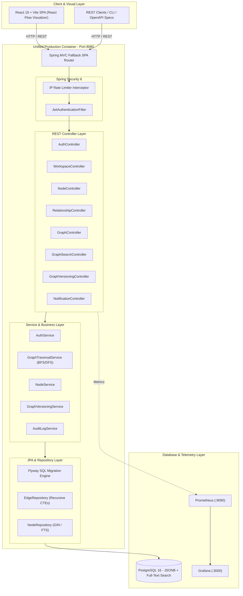

# 🧠 KnowledgeNetwork

> **Enterprise-Grade Collaborative Knowledge Graph & Traversal Platform**

[](https://www.oracle.com/java/)
[](https://spring.io/projects/spring-boot)
[](https://react.dev/)
[](https://www.typescriptlang.org/)
[](https://vitejs.dev/)
[](https://www.postgresql.org/)
[](https://www.docker.com/)
[](https://github.com/features/actions)
[](LICENSE)

---

## 📋 Table of Contents

- [Overview](#-overview)
- [Key Features](#-key-features)
- [System Architecture](#-system-architecture)
- [Tech Stack](#-tech-stack)
- [Getting Started](#-getting-started)
  - [Prerequisites](#prerequisites)
  - [Environment Setup](#environment-setup)
  - [Running with Docker Compose (Recommended)](#running-with-docker-compose-recommended)
  - [Running for Local Development](#running-for-local-development)
- [Database & Schema Migrations](#-database--schema-migrations)
- [API Reference & Documentation](#-api-reference--documentation)
- [Authentication & Security Lifecycle](#-authentication--security-lifecycle)
- [Observability & Monitoring](#-observability--monitoring)
- [CI/CD Pipeline](#-cicd-pipeline)
- [Project Structure](#-project-structure)
- [License](#-license)

---

## 📌 Overview

**KnowledgeNetwork** is a production-ready, full-stack collaborative knowledge graph management platform designed to model, visualize, traverse, and version complex interconnected domain knowledge.

By leveraging **PostgreSQL 16** Recursive Common Table Expressions (CTEs) and JSONB GIN indexing alongside **Spring Boot 3.2 (Java 21)** and **React 19 (TypeScript + React Flow)**, KnowledgeNetwork provides high-performance graph traversal algorithms (BFS/DFS) and real-time interactive graph visualization without requiring the operational complexity of a separate graph database engine.

---

## ✨ Key Features

### 🎨 1. Interactive Visual Graph Canvas
- **React Flow Integration**: Interactive canvas (`@xyflow/react`) supporting drag-and-drop node placement, custom nodes, edge styling, zoom/pan controls, and position persistence.
- **Dynamic Node & Edge Types**: Color-coded node categories, custom icons, and typed relationships (directed/undirected with weights).
- **Flexible Attribute Schemas**: Store structured metadata and dynamic key-value properties backed by PostgreSQL `JSONB`.

### 🔒 2. Multi-Tenant Workspaces & RBAC
- **Workspace Isolation**: Logical data multi-tenancy per workspace ensuring zero cross-tenant leakage.
- **Granular Access Control**: Role-Based Access Control (RBAC) with predefined permissions:
  - `WORKSPACE_OWNER`: Full administrative privileges over workspace settings, membership, and data.
  - `WORKSPACE_EDITOR`: Create, edit, and delete nodes, relationships, tags, and versions.
  - `WORKSPACE_VIEWER`: Read-only access to graph visualizer, search, export, and traversal APIs.
- **Visibility Settings**: Public or private workspace accessibility modes.

### ⚡ 3. Enterprise Graph Traversal & Search Engine
- **Recursive CTE Graph Traversal**: High-speed Breadth-First (BFS) and Depth-First (DFS) graph traversal up to $N$ hops executed natively in PostgreSQL.
- **Full-Text & Property Search**: Instant text search across node labels and dynamic attributes using PostgreSQL `tsvector` / `tsquery` and GIN indexes.

### 🕒 4. Graph Versioning & Snapshot Revisioning
- **Time-Travel Snapshots**: Capture immutable graph state snapshots at any milestone.
- **Version History & Rollback**: Browse historical version logs, compare changes, and revert graphs to earlier revisions.

### 🔐 5. Security & Authentication Infrastructure
- **Stateless JWT Authentication**: Access tokens paired with HttpOnly Refresh Token rotation.
- **Gmail OTP & Email Verification**: Secure email-based OTP user verification lifecycle.
- **Defense in Depth**: BCrypt password hashing (cost factor 12), IP-based rate-limiting interceptors, method-level Spring Security (`@PreAuthorize`), and strict CORS policies.

### 📊 6. Collaboration & Social Features
- **User Profiles & Workspace Sharing**: Profile customization and seamless member invitations.
- **Audit Logging**: Comprehensive activity feed logging mutations with snapshot JSON deltas.
- **In-App Notifications**: Real-time notifications for system and workspace events.

### 🚀 7. Unified Production Deployment & Monitoring
- **Multi-Stage Docker Packaging**: Single container serving both the optimized Vite React SPA and Spring Boot REST API on port `8080` with SPA fallback routing.
- **Prometheus & Grafana Stack**: Built-in monitoring stack tracking application metrics, database pool health, and HTTP request throughput via Spring Boot Actuator.

---

## 🏗️ System Architecture



---

## 🛠️ Tech Stack

| Category | Technology / Library | Description |
| :--- | :--- | :--- |
| **Backend Core** | Java 21 LTS, Spring Boot 3.2.5 | Enterprise runtime with modern Java feature set |
| **Security** | Spring Security 6, JJWT 0.12.5 | JWT stateless security, BCrypt hashing, OTP verification |
| **Data Persistence** | Spring Data JPA, Hibernate, PostgreSQL 16 | Relational graph storage with JSONB & Recursive CTEs |
| **Database Migrations**| Flyway 10.11.0 | Versioned SQL schema migration engine |
| **Frontend Framework**| React 19, TypeScript 5.7, Vite 6 | Modern, high-performance UI build framework |
| **Graph Visualization**| `@xyflow/react` (React Flow 12) | Interactive drag-and-drop node & edge canvas |
| **Styling & Motion** | TailwindCSS 3.4, Framer Motion | Cyberpunk / modern dark aesthetic & responsive UI |
| **State & Data Fetching**| TanStack React Query 5, Axios | Server state management and optimistic caching |
| **Forms & Validation** | React Hook Form, Zod, Jakarta JSR-380 | Dual-layer client & server-side validation |
| **Containerization** | Docker, Docker Compose | Multi-stage production container build topology |
| **Observability** | Prometheus, Grafana, Spring Actuator | System telemetry, health checks, and performance metrics |
| **CI/CD** | GitHub Actions | Automated Maven test execution & GHCR image publishing |

---

## 🚀 Getting Started

### Prerequisites

Before setting up KnowledgeNetwork, ensure you have the following installed:

- **Docker** 24.0+ and **Docker Compose** v2+
- **Java JDK 21** (if building locally without Docker)
- **Node.js** 20+ & **npm** 10+ (if developing frontend locally)
- **PostgreSQL 16** (if running DB outside Docker)

---

### Environment Setup

1. **Clone the Repository:**
   ```bash
   git clone https://github.com/your-username/KnowledgeNetwork.git
   cd KnowledgeNetwork
   ```

2. **Configure Environment Variables:**
   Create a `.env` file in the root directory by copying `.env.example`:
   ```bash
   cp .env.example .env
   ```

3. **Update Secret Keys in `.env`:**
   ```env
   # Mail Service Configuration (Gmail SMTP / OTP)
   MAIL_USERNAME=your-email@gmail.com
   MAIL_PASSWORD=your-google-app-password
   SPRING_MAIL_HOST=smtp.gmail.com
   SPRING_MAIL_PORT=587

   # Database Credentials
   POSTGRES_DB=knowledgenetwork_db
   POSTGRES_USER=kn_admin
   POSTGRES_PASSWORD=your_secure_postgres_password
   SPRING_DATASOURCE_URL=jdbc:postgresql://postgres:5432/knowledgenetwork_db

   # JWT Security Key (Minimum 256 bits)
   APP_JWT_SECRET=9a6f8b12c4e5d6a7b8c9d0e1f2a3b4c5d6e7f8a9b0c1d2e3f4a5b6c7d8e9f0a1
   APP_JWT_ISSUER=knowledgenetwork-api

   # Monitoring Passwords
   GRAFANA_ADMIN_PASSWORD=your_secure_grafana_password
   ```

---

### Running with Docker Compose (Recommended)

To start the full production stack (Database + Unified API & Frontend + Prometheus + Grafana):

```bash
# Build and launch all containers in detached mode
docker compose up --build -d
```

#### Access Points:
- 🌐 **Web Application & REST API**: [http://localhost:8080](http://localhost:8080)
- 📚 **Swagger OpenAPI Docs**: [http://localhost:8080/swagger-ui.html](http://localhost:8080/swagger-ui.html)
- 📊 **Grafana Dashboard**: [http://localhost:3000](http://localhost:3000) (User: `admin`)
- 📈 **Prometheus Metrics**: [http://localhost:9090](http://localhost:9090)
- 💓 **Health Check Endpoint**: [http://localhost:8080/actuator/health](http://localhost:8080/actuator/health)

#### Container Operations:
```bash
# View active service statuses
docker compose ps

# Tail application logs
docker compose logs -f app

# Stop all containers
docker compose down
```

---

### Running for Local Development

#### 1. Start PostgreSQL Database
```bash
docker compose up postgres -d
```

#### 2. Run Backend (Spring Boot)
Ensure `.env` matches your local database port (e.g. `localhost:5432`):
```bash
./mvnw clean spring-boot:run
```

#### 3. Run Frontend (React Vite)
In a separate terminal tab:
```bash
cd frontend
npm install
npm run dev
```
The Vite dev server will start at `http://localhost:5173` with proxy configuration pointing to `http://localhost:8080`.

---

## 🗄️ Database & Schema Migrations

KnowledgeNetwork uses **Flyway** for database version management. Database schemas are located in `src/main/resources/db/migration/`:

| Version Script | Description |
| :--- | :--- |
| `V1__init_schema.sql` | Core schema (Users, Workspaces, Nodes, Edges, Node Types, Edge Types, Audit Logs) |
| `V2__add_role_and_refresh_tokens.sql` | User roles & refresh token persistence table |
| `V3__add_graph_versioning.sql` | Graph version snapshots & revision management tables |
| `V4__add_node_search_fields.sql` | Full-text search `tsvector` columns & GIN indexes |
| `V5__add_social_module.sql` | Social interactions, workspace sharing & collaboration |
| `V6__add_profile_fields.sql` | User profile avatar & bio attributes |
| `V7__alter_version_to_bigint.sql` | Migration for JPA `@Version` concurrency counters |
| `V8__add_notifications.sql` | User notification system schema |
| `V9__add_email_verification_and_otps.sql` | Email verification status & OTP token tracking |
| `V10__add_workspace_visibility.sql` | Public / Private workspace visibility flags |
| `V11__add_node_positions.sql` | Node $X, Y$ coordinate persistence for visual canvas sync |

---

## 📖 API Reference & Documentation

Interactive API documentation is generated via SpringDoc OpenAPI and available live at `/swagger-ui.html`.

### Core API Endpoints

#### 🔑 Authentication (`/api/v1/auth`)
- `POST /api/v1/auth/register` - Register a new user account.
- `POST /api/v1/auth/verify-otp` - Verify email OTP code.
- `POST /api/v1/auth/login` - Authenticate & obtain JWT Access + Refresh token.
- `POST /api/v1/auth/refresh` - Rotate access token using HttpOnly refresh cookie.

#### 🏢 Workspaces (`/api/v1/workspaces`)
- `GET /api/v1/workspaces` - Retrieve user's accessible workspaces.
- `POST /api/v1/workspaces` - Create a new workspace.
- `GET /api/v1/workspaces/{id}` - Get workspace metadata and membership.
- `POST /api/v1/workspaces/{id}/members` - Add member with specified RBAC role (`EDITOR`, `VIEWER`).

#### 🟢 Graph Nodes (`/api/v1/nodes`)
- `GET /api/v1/nodes?workspaceId={id}` - Retrieve workspace nodes.
- `POST /api/v1/nodes` - Create a graph entity node with custom JSONB properties.
- `PUT /api/v1/nodes/{id}` - Update node label, attributes, or canvas position.
- `DELETE /api/v1/nodes/{id}` - Soft-delete node.

#### 🔗 Graph Relationships (`/api/v1/relationships`)
- `POST /api/v1/relationships` - Create a directed or undirected edge between two nodes.
- `PUT /api/v1/relationships/{id}` - Update relationship attributes or weight.
- `DELETE /api/v1/relationships/{id}` - Delete relationship.

#### 🔄 Graph Traversal & Search (`/api/v1/graphs` & `/api/v1/search`)
- `POST /api/v1/graphs/traverse` - Execute recursive CTE traversal (BFS/DFS) up to $N$ hops.
- `GET /api/v1/search/nodes?workspaceId={id}&query={searchTerm}` - Full-text search across nodes.

---

### Sample Graph Traversal Request

```http
POST /api/v1/graphs/traverse
Authorization: Bearer <your_jwt_access_token>
Content-Type: application/json

{
  "workspaceId": "8f3d1b72-5e4a-4a6c-9c1a-2b3c4d5e6f7a",
  "rootNodeId": "c39e6a72-4b2a-43d9-952a-9e1f5a7d3f11",
  "maxDepth": 3,
  "edgeTypeNames": ["DEPENDS_ON", "USES"],
  "direction": "OUTGOING"
}
```

---

## 🔒 Authentication & Security Lifecycle

1. **User Registration & OTP Validation**: Registration requires validating a 6-digit email OTP sent via Gmail SMTP.
2. **Stateless JWT Claims**: Upon successful login, an Access Token (15 min validity) and Refresh Token (7 days validity) are generated.
3. **Optimistic Locking**: Data updates include version tracking (`@Version` / `version` column) to prevent concurrent overwrite race conditions (returning HTTP 409 Conflict on version mismatch).
4. **Zero Trust Data Access**: Access is controlled via Spring Security method annotations (`@PreAuthorize`), checking workspace membership before executing operations.

---

## 📈 Observability & Monitoring

KnowledgeNetwork includes built-in enterprise observability out of the box:

- **Spring Boot Actuator**: Exposes operational health, info, and Prometheus format metrics.
- **Prometheus Service**: Scrapes metrics from `:8080/actuator/prometheus` every 15 seconds.
- **Grafana Dashboards**: Visualizes JVM garbage collection, HikariCP database pool utilization, API latency, and HTTP response status distributions.

---

## 🔄 CI/CD Pipeline

The project uses **GitHub Actions** (`.github/workflows/ci.yml`) for automated integration and delivery:

1. **Continuous Integration**: Runs on push to `main` and pull requests.
   - Spins up a PostgreSQL 16 service container.
   - Executes Maven test suite (`./mvnw test`).
2. **Container Delivery**: On merges to `main`, automatically builds and pushes the production Docker image to **GitHub Container Registry (GHCR)**:
   `ghcr.io/<repository_owner>/knowledgenetwork:latest`

---

## 📁 Project Structure

```
KnowledgeNetwork/
├── .github/
│   └── workflows/
│       └── ci.yml                 # GitHub Actions CI/CD Pipeline
├── docs/                          # Additional Documentation & Diagrams
├── frontend/                      # React 19 + TypeScript + Vite Client App
│   ├── src/
│   │   ├── components/            # React Flow Canvas, Modals, Forms & UI Components
│   │   ├── hooks/                 # Custom React Hooks & State Queries
│   │   ├── services/              # Axios API Client & Authentication Handlers
│   │   └── types/                 # TypeScript Interfaces & API Types
│   ├── package.json
│   ├── tailwind.config.ts
│   └── vite.config.ts
├── monitoring/
│   └── prometheus.yml             # Prometheus Scrape Configuration
├── src/
│   ├── main/
│   │   ├── java/com/knowledgenetwork/
│   │   │   ├── config/            # Security, OpenAPI, JPA & App Beans Configuration
│   │   │   ├── controller/        # REST API Endpoint Controllers
│   │   │   ├── common/            # DTO Envelopes, Exceptions & Global Advice
│   │   │   ├── domain/            # JPA Entities, Models & Requests/Responses
│   │   │   ├── repository/        # Spring Data Repositories & Recursive CTEs
│   │   │   ├── security/          # JWT Filters, UserDetailsService & Principal
│   │   │   └── service/           # Business Logic Services
│   │   └── resources/
│   │       ├── db/migration/      # Flyway Versioned SQL Scripts (V1 to V11)
│   │       ├── application.yml    # Application Configuration Settings
│   │       └── logback-spring.xml # Centralized Logging Setup
│   └── test/                      # Unit & Integration Test Suites
├── ARCHITECTURE.md                # Comprehensive Architecture Specification
├── DEPLOYMENT_GUIDE.md            # Production Deployment Instructions
├── Dockerfile                     # Multi-Stage Production Docker Build
├── docker-compose.yml             # Container Orchestration Stack
├── pom.xml                        # Maven Dependencies & Build Configuration
└── README.md                      # Project Documentation
```

---

## 📄 License

This project is licensed under the **MIT License** - see the [LICENSE](LICENSE) file for details.

---

<p center align="center">
  Designed & Built with ❤️ for Collaborative Knowledge Engineering
</p>
